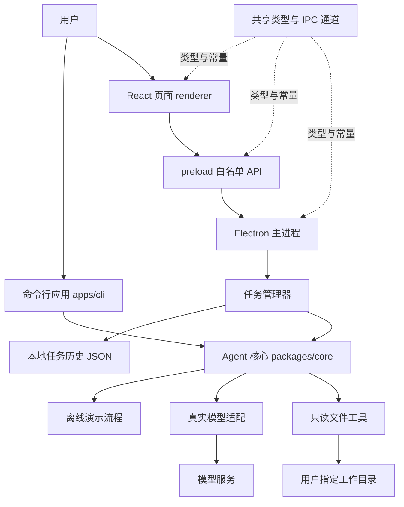
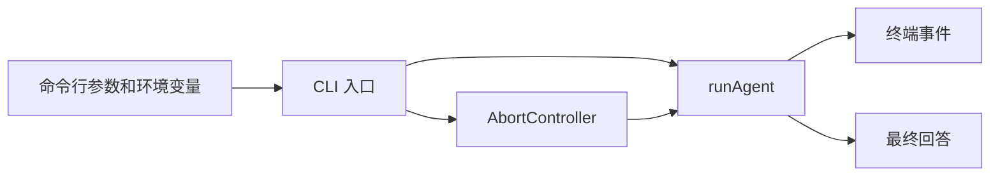
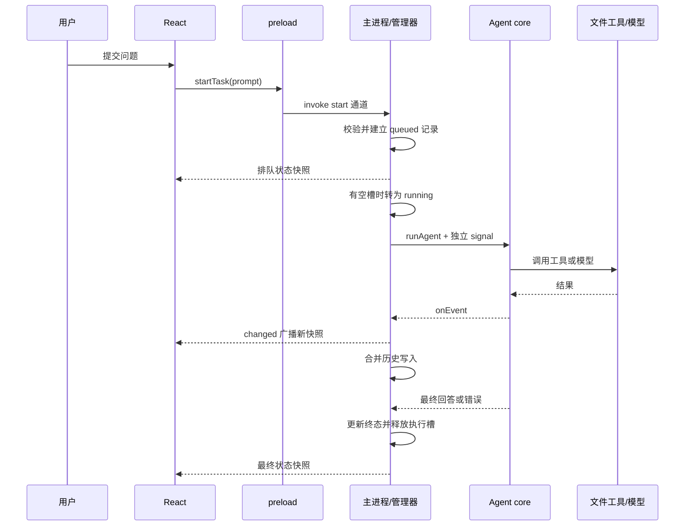
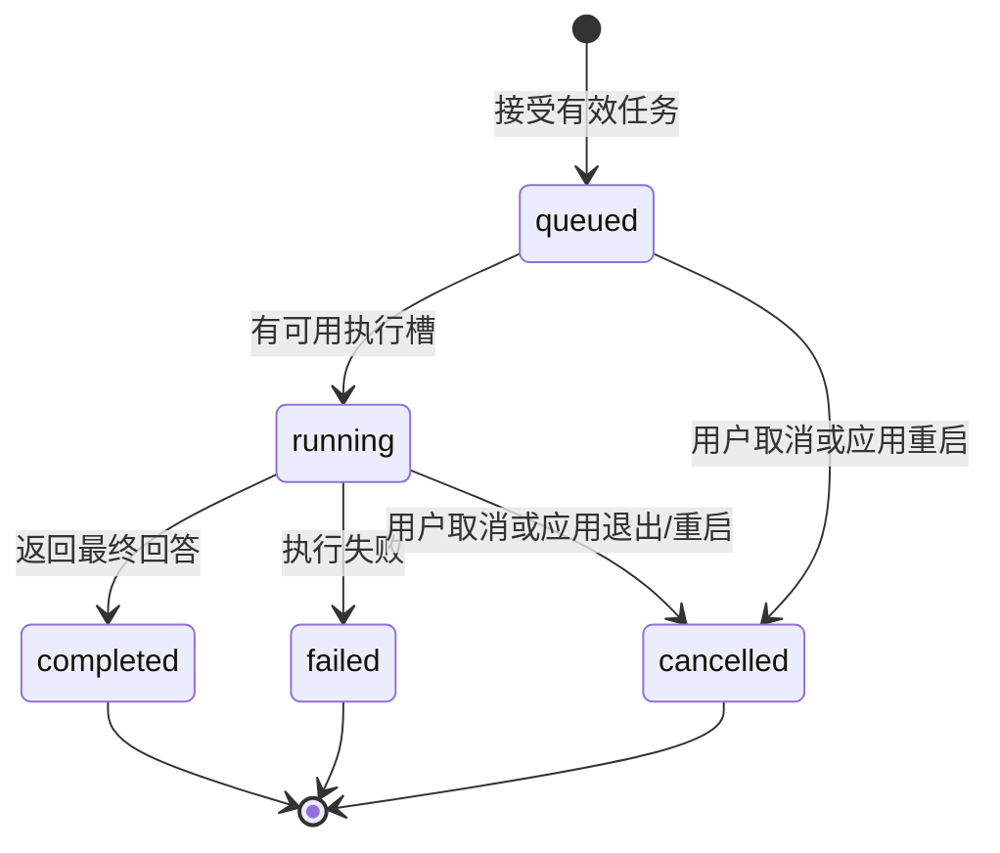
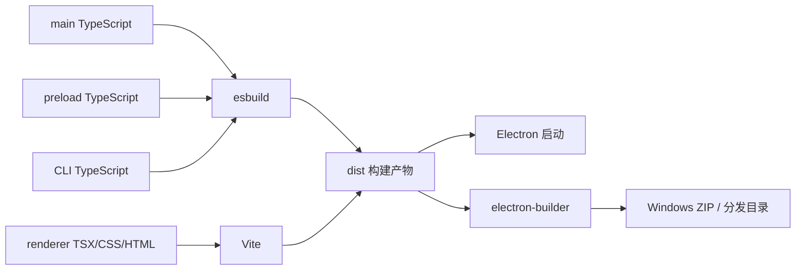

# 架构分析：Electron Agent Lab

本文按三个学习单元分析模板：**核心库、命令行应用、桌面应用**。它们共享一个根目录 `package.json`，不是三个独立发布的产品，也不需要分别安装依赖。

设计目标是让初学者看到一次任务如何从用户输入走到工具执行、状态更新和历史记录。源码采用逐行中文注释；本文解释跨文件关系、设计原因和实现边界。

## 1. 整体架构

### 依赖方向

| 模块 | 可以依赖 | 不应依赖 |
|---|---|---|
| `packages/shared` | 基础 TypeScript 类型 | Electron、React、文件系统和模型服务 |
| `packages/core` | Node.js API、共享事件类型 | Electron 窗口、React 组件、页面状态 |
| `apps/cli` | core、Node.js | Electron、React |
| desktop main | Electron、core、shared | React 组件 |
| desktop preload | Electron IPC、shared | 任务调度、模型 Key、文件扫描逻辑 |
| desktop renderer | React、shared、预加载桥接 API | Node.js 文件能力、原始 IPC、模型 Key |

核心执行逻辑不从桌面层反向导入内容，因此 CLI 可以复用它，测试也可以脱离桌面窗口运行。`shared` 只统一形状与名称，不负责执行任何业务。

### 为什么采用单根 package

这份模板的学习目标是 Electron 和 Agent，不是 npm 包发布。使用一个依赖锁文件和一组命令，能减少初学阶段的安装与配置成本。目录仍保留了边界，后续可以逐步提取独立包，但当前不能假定每个目录都有自己的 `package.json` 或发布流程。

## 2. 学习单元一：文件工具与 Agent 核心

位置：`packages/core/src`。

### 2.1 对外执行接口

上层通过 `runAgent` 提供任务上下文：

| 参数 | 作用 | 谁提供 |
|---|---|---|
| `workspacePath` | 本次任务允许处理的根目录 | CLI 参数或桌面任务快照 |
| `prompt` | 用户需求 | CLI 参数或页面输入 |
| `mode` | `demo` 或 `openai` | 环境/启动参数 |
| `model` | 真实模式的模型名称 | 用户配置 |
| `apiKey` | 真实模式凭据 | 本地执行侧环境变量 |
| `signal` | 取消信号 | CLI 或桌面管理器创建的控制器 |
| `onEvent` | 报告工具、说明和回答事件 | CLI 打印器或桌面任务日志 |
| `maxSteps` | 限制 Agent 循环步骤 | 调用方可选设置 |
| `fetchImpl` | 在测试中注入模拟网络响应 | 自动化测试；正常运行可不传 |

执行函数返回最终回答，过程中通过回调报告事件。核心不决定 UI 应该展示哪张卡片，也不负责保存桌面历史；这些属于调用方的职责。

### 2.2 只读工具层

`tools.ts` 对外提供三个工具，并通过 `invoke` 的白名单分发调用：

| 工具 | 输入 | 输出 | 用途 |
|---|---|---|---|
| `list_files` | 可选相对目录 `path` | 条目及 `truncated` | 查看有限范围内的项目结构 |
| `read_file` | 必填相对文件 `path` | 文本、路径及 `truncated` | 读取一个小型文本文件 |
| `search_text` | `query` 与可选 `path` | 命中行、截断标记和跳过文件数 | 执行大小写不敏感的字面量搜索 |

模型输出是运行时输入，工具先检查“是否为对象”“有没有未知字段”“字段类型和长度是否正确”，再进行文件访问。TypeScript 类型不能代替这些检查。

### 2.3 目录与资源边界

安全路径解析分两次检查：先检查输入路径在语法上是否合法，再用 `realpath` 检查符号链接解析后的实际位置。

模板的明确限制如下：

| 限制 | 当前值或规则 | 解决的问题 |
|---|---|---|
| 单文件读取字节数 | 128 KiB | 避免把大文件全部载入内存 |
| 单文件返回文本 | 最多 32,000 字符 | 控制上下文和展示规模 |
| 目录扫描条目数 | 最多 200，包含目录与文件 | 防止无界枚举 |
| 实际遍历目录数 | 最多 80 | 限制宽目录树扫描 |
| 下探深度 | 按 `maxDepth = 8` 控制 | 限制深目录树成本 |
| 搜索命中数 | 最多 40 | 限制结果规模 |
| 单条命中文本 | 最多 240 字符 | 控制日志和模型输入 |
| 搜索方式 | 字面量，不执行用户正则 | 避免正则表达式额外资源风险 |
| 扫描符号链接 | 枚举时跳过 | 避免循环和意外跨目录扫描 |

隐藏路径、常见依赖与构建目录、部分凭据名称和私钥后缀会被忽略。结果会明确说明截断和跳过情况，使用者不能把有限结果解释成“已经检查所有内容”。

这些检查是应用层防护，**不是操作系统级文件沙箱**。文件名规则无法识别普通文件内的秘密，也不能声称完全消除恶意进程同时修改文件系统带来的竞态。实际产品需要根据威胁模型设计更强的文件访问隔离。

### 2.4 离线模式与真实模型模式

`index.ts` 中的 `runDemo` 使用确定性的演示流程，工具仍然真实访问示例目录。问题包含 `TODO` 或“搜索”时，固定搜索 TODO；其他问题进入目录概览，并尝试预览最多两个文本文件。它的价值是让你稳定观察调用、日志、取消和页面状态；它不会任意理解所有自然语言任务。

真实模式把用户问题、工具声明和调用结果交给模型，模型提出下一步工具调用，程序在白名单范围内实际执行。模型名称由用户填写，不在模板中硬编码某一个账户可能无法使用的名称。

工具层不会因提示词内容改变权限。即使文件内容要求访问外部目录，工具仍执行相同的路径检查；模型提出未知工具，也会被拒绝。

真实调用当前也位于 `index.ts`：`requestModel` 负责 HTTP 与响应读取，`runOpenAI` 负责上下文和工具循环。请求固定发送到 OpenAI Responses API，不接受由模型返回的任意服务地址。

| 真实模式限制 | 当前实现 |
|---|---|
| 请求轮数 | 默认 5，调用方可设 1—8 |
| 单轮工具调用 | 最多 4，按顺序执行 |
| 单次请求与正文读取 | 30 秒超时 |
| 响应正文大小 | 最多 1 MiB |
| 本地上下文长度 | `messages` 序列化后最多 240,000 字符，不是 Token 数 |
| 最终回答长度 | 最多 16,000 字符 |
| 模型输出配置 | `max_output_tokens` 为 1,200 |
| 网络测试 | 通过 `fetchImpl` 注入模拟响应 |

工具反馈通过 `call_id` 对应原始调用；继续请求时保留完整模型输出，避免丢失续接所需项目。达到轮数上限仍没有最终答案时，任务明确失败。

当前读取完整 JSON 响应后再处理，**没有逐字流式回答**。使用流式读取 HTTP 正文是为了限制接收大小，不等于实现了模型 SSE 流式事件。模板也没有自动限流重试；HTTP 失败会报告状态码。

### 2.5 核心层的取舍

- 使用少量只读工具，使学习重点落在调用链和边界，不同时引入写文件与命令执行的复杂性。
- 文件扫描限制总量并控制读取过程，但没有为大型代码库设计索引服务。
- 工具通过异步文件 API 工作；异步不代表所有 JavaScript 计算都自动迁移到后台线程。
- 模型交互和文件处理由同一取消信号协调，取消采用协作检查方式，不保证任意一个已经进入系统调用的步骤瞬间停止。
- 上下文限制有助于控制规模，但不是完整的记忆、检索与历史压缩系统。

## 3. 学习单元二：命令行应用

位置：`apps/cli/src/index.ts`。

### 3.1 职责

CLI 负责解析工作目录、问题和模式，创建取消控制器，将 core 事件打印到终端，再展示最终结果。它可以在没有 Electron 窗口的环境中验证核心业务。

### 3.2 为什么保留 CLI

当桌面任务没有得到结果时，先对相同目录运行 CLI，可以缩小排查范围：CLI 也失败，优先检查参数、文件和模型；CLI 正常，继续检查 IPC、任务管理与页面展示。

CLI 不是另写的一套 Agent，不应复制文件工具或模型调用代码。它也不复用桌面任务历史；“运行一次任务”是它的主要使用方式。

### 3.3 扩展方向

可添加结构化 JSON 输出、从文件读取问题、按退出码区分错误，以及使用固定样例批量验证任务结果。新增功能仍然应该调用公共核心，避免两套实现逐渐产生差异。

## 4. 学习单元三：Electron 桌面应用

位置：`apps/desktop`。

### 4.1 三个运行位置

| 位置 | 职责 | 例子 |
|---|---|---|
| 主进程 main | 管理窗口、任务、目录选择、历史、IPC | 收到开始请求后创建任务 |
| preload | 向页面提供少量命名函数 | `startTask(prompt)` |
| renderer | 展示应用状态和收集用户输入 | 任务卡片、日志、取消按钮 |

preload 不应变成另一份业务层。它主要负责桥接，使页面通过清晰接口请求能力，而不是把 Node.js 或整个 IPC 对象交给页面。

### 4.2 窗口与资源来源

主窗口开启 `contextIsolation`、`sandbox` 和 `webSecurity`，关闭 `nodeIntegration`。preload 路径指向构建后的 `preload.cjs`。

开发只接受 `http://127.0.0.1:5173`。生产通过 `lab://bundle/index.html` 加载页面，自定义协议将资源限制在 `dist/renderer` 内，只处理对应主机的 GET 请求，并检查路径边界。

IPC 只接受当前窗口的主框架与允许的文档来源。应用拒绝新窗口、页面/子框架导航、webview 与额外系统权限请求；HTML 中另外配置了内容安全策略。开发调试所需的本地 WebSocket 与样式策略保留在模板里，正式产品可按实际发布链进一步收紧。

Windows/Linux 关闭最后一个窗口会退出；macOS 的窗口关闭与应用退出按不同生命周期处理，重新激活时可以重开窗口。跨平台代码分支存在，不代表已经在所有平台实测。

### 4.3 IPC 契约

通道集中定义于 `packages/shared/src/contracts.ts`：

| 桥接 API | 通道 | 方向 | 意义 |
|---|---|---|---|
| `getState()` | `lab:get-state` | 页面请求主进程 | 获取当前完整快照 |
| `selectWorkspace()` | `lab:select-workspace` | 页面请求主进程 | 打开系统对话框并更新默认目录 |
| `startTask(prompt)` | `lab:start-task` | 页面请求主进程 | 校验输入并创建排队任务 |
| `cancelTask(taskId)` | `lab:cancel-task` | 页面请求主进程 | 请求取消任务 |
| `onState(listener)` | `lab:state-changed` | 主进程通知页面 | 广播完整状态，并提供取消订阅函数 |

请求入口检查来源和参数；工具层继续检查具体工具参数与目录边界。IPC 校验与工具校验处于不同层，不能互相替代。

### 4.4 一次桌面任务的时序

共享状态包含递增 `revision`。页面可以据此忽略迟到的旧响应，避免“新广播先到、旧请求后到”时界面退回之前的状态。

## 5. 任务管理与持久化

具体实现集中在 `apps/desktop/src/main/task-manager.ts`，便于对调度器进行独立测试。

### 5.1 状态机

模板没有 `waiting_for_user` 状态，也没有工具授权弹窗工作流。未来增加写操作时，应先补充相应任务状态和授权语义。

### 5.2 并发与队列

- 最多同时运行 **2** 个任务。
- 排队与运行中的任务合计最多 **8** 个，超过后拒绝新任务。
- 按先提交先执行调度，页面列表则按新到旧展示。
- 每个运行任务有自己的 AbortController。
- 并发槽由仍未释放的控制器数量计算，取消后要等实际执行退出才释放槽位。
- 创建任务时固定目录和模式，之后页面更换默认目录不会改写旧任务。

这是单进程内存队列，不是分布式任务服务。它适合教学和少量桌面任务，没有跨进程调度、租约或分布式锁。

### 5.3 取消语义

取消时先把任务状态设为 `cancelled`，再向执行器发送取消信号。执行结果返回后会再次检查信号，避免迟到结果把已取消任务改成完成。

排队任务不再启动；运行任务不再安排后续步骤，并在工具和请求的取消检查处退出。界面出现“已取消”表示取消请求已经生效，不应理解为任意底层系统调用都已在同一瞬间结束。

### 5.4 历史记录

正常启动时，历史保存在 `app.getPath("userData")` 目录下的 `history.json`。`pnpm dev` 明确将用户数据目录设为项目内的 `.local-data/dev`，因此开发与分发版本的历史互相隔离。管理器接收 `historyFile` 参数，测试可以使用临时目录；桌面验证也可用 `AGENT_LAB_USER_DATA` 指定隔离目录。

| 行为 | 当前实现 |
|---|---|
| 保留范围 | 创建任务时保留近期 20 条，并保留全部活跃任务；恢复时最多 20 条 |
| 日志数量 | 每任务最近 80 条 |
| 日志文本 | message 最多 1,000 字符，detail 最多 8,000 字符 |
| 写入合并 | 连续更新在 150 毫秒内合并 |
| 写入顺序 | Promise 队列串行执行 |
| 文件替换 | 先写同目录 `.tmp`，再 rename 替换 |
| 启动恢复 | 校验关键字段，过滤无效记录 |
| 中断恢复 | 原 queued/running 转为 cancelled，并提示重新提交 |

临时文件替换降低直接写坏旧文件的风险，但没有数据库事务、迁移系统或掉电完整性保证。损坏历史不会阻止首次打开应用；保存失败会输出诊断，但模板尚未提供完整的用户侧存储故障界面。

历史含问题、目录、回答与部分工具日志，是本地产品数据。API Key 不进入正常产生的任务快照。文件内容可能出现在日志或回答里，真实产品应设计数据保留与清理功能。

## 6. 页面状态与性能取舍

页面将后台快照作为任务事实来源，将输入框和选中任务作为本地交互状态。这样避免页面自己推断后台执行成功或失败。

`main.tsx` 通过 `createElement` 的别名 `h` 构建 React 元素，让逐行注释在每个作用域和元素结束行都能保持合法。`App` 管理交互，`TaskCard` 展示历史，`EventCard` 展示日志，`StatusBadge` 统一状态标签，`LearningPanel` 解释当前调用链。全局 `Window.desktop` 类型也在该文件中声明。

工具详情使用原生 `details/summary` 折叠，回答与工具文本均按文本渲染，没有把外部内容插入 `innerHTML`。页面首次加载时先订阅广播，再获取状态，卸载时移除同一个包装监听器。

当前每次状态更新广播完整快照，结构直观，便于初学者追踪与调试。代价是任务和日志变多时，序列化、IPC 传输与 React 更新成本一起增长。

模板通过任务和日志数量上限控制学习规模；持久化进行了短时间合并，但这不等于 IPC 已按增量批量发送，也不等于大型项目的性能问题已解决。

后续优化应先测量，再选择：

1. 合并短时间内的状态通知。
2. 只广播发生变化的任务或事件。
3. 按需加载历史详情和日志。
4. 对长列表使用虚拟化。
5. 把 CPU 密集计算移到 Worker 或其他执行进程。

不要只因为函数是 async，就认为它不会阻塞主进程中的 JavaScript 执行。

## 7. 模型凭据与数据流

真实模式使用 `AGENT_MODE=openai`、`OPENAI_API_KEY` 和 `OPENAI_MODEL` 配置。桌面由主进程继承环境变量，CLI 从其进程环境读取。页面只需要知道模式和模型名称，不需要密钥。

真实模式中的数据流是：本地工具在授权目录内取得有限内容 → 核心将需要的工具结果加入模型上下文 → 请求模型服务。因而“文件只读”不表示“文件内容永远留在本机”。demo 不调用模型服务。

模板没有自动把系统环境变量、整个目录或任意本地文件发送给模型；工具也没有读取环境变量或执行 Shell 的能力。目录选择应使用可供模型处理的示例资料。

企业桌面产品若要使用共享凭据，需要另行建立用户认证、服务端模型代理、配额、审计和凭据轮换方案，不能把长期共享密钥藏进安装包。

## 8. 构建与发布

esbuild 负责主进程、preload 与 CLI 的构建；Vite 负责 React 页面。Electron 通过根配置中的入口启动构建后的主进程。

| 构建入口 | 产物 |
|---|---|
| `apps/desktop/src/main/index.ts` | `dist/main/index.cjs` |
| `apps/desktop/src/preload/index.ts` | `dist/main/preload.cjs` |
| `apps/desktop/src/renderer/main.tsx` | `dist/renderer` 内 HTML 和资源 |
| `apps/cli/src/index.ts` | `dist/cli/index.cjs` |

preload 被打成一个文件，避免沙箱在运行时加载额外本地模块。构建后的 CLI 可用 Node 直接执行，开发期的 `pnpm cli` 则通过 tsx 读取 TypeScript。

打包时，`extraResources` 将样例目录复制到 `resources/workspace`。主进程在开发环境使用 `examples/workspace`，在分发环境使用 `process.resourcesPath/workspace`。这样，文件工具处理的是普通文件系统目录，而不是 ASAR 内的虚拟路径。

桌面自动化通过 `AGENT_LAB_HEADLESS=1` 启用隐藏窗口、软件离屏绘制，并使用 Electron 原生 `capturePage` 保存图片。正常启动没有开启这项测试配置。该验证覆盖真实页面和 IPC，但不代表已经测量正常 GPU 加速模式的性能。

`scripts/smoke-desktop.mjs` 默认验证构建后的生产页面，`--dev` 验证本地 Vite 页面，`AGENT_LAB_EXECUTABLE` 指定打包目录内的可执行文件。开发与打包模式不能同时启用。首次验证和修改源码后需要先构建；截图来自原生离屏页面，无需弹出用户可见窗口。

开发环境下页面由 Vite 提供并热更新；主进程和 preload 修改后需要重启开发命令。生产构建读取已构建的静态页面，不依赖开发服务器。

打包配置生成可分发目录或 Windows ZIP，ZIP 需要完整解压后运行；当前目标文件名为 `release/Electron-Agent-Lab-0.1.0-x64.zip`。模板尚未提供自动更新服务、签名证书和多平台验证。`build` 成功也不能替代分发后启动、目录访问、任务执行与退出的实际验证。

## 9. 文件职责索引

| 文件或目录 | 阅读目的 |
|---|---|
| `packages/shared/src/contracts.ts` | 先理解状态、事件与页面能力 |
| `packages/core/src/tools.ts` | 理解文件边界、资源限制和工具分发 |
| `packages/core/src/index.ts` | 从公共执行入口追踪 Agent 流程 |
| `apps/cli/src/index.ts` | 观察最少依赖的核心调用方式 |
| `apps/desktop/src/main/index.ts` | 理解 Electron 生命周期、窗口、资源协议与 IPC |
| `apps/desktop/src/main/task-manager.ts` | 理解状态机、队列、取消、日志和存储 |
| `apps/desktop/src/preload/index.ts` | 理解能力白名单和事件订阅清理 |
| `apps/desktop/src/renderer/main.tsx` | 理解快照展示、输入和任务交互 |
| `apps/desktop/src/renderer/styles.css` | 理解布局、滚动区、状态样式和响应式展示 |
| `apps/desktop/src/renderer/assets.d.ts` | 让 TypeScript 识别样式资源导入 |
| `apps/desktop/index.html` | 理解挂载节点、入口和内容安全策略 |
| `apps/desktop/vite.config.ts` | 理解页面构建与开发服务 |
| `scripts/build.mjs` | 生成后台、preload、页面与 CLI 构建产物 |
| `scripts/dev.mjs` | 协调后台构建、Vite、Electron 与退出清理 |
| `scripts/check-comments.mjs` | 检查非空源码行的中文注释覆盖 |
| `scripts/explain-config.mjs` | 生成标准 JSON 的逐行解释文档 |
| `scripts/smoke-desktop.mjs` | 启动桌面验证并记录结果 |
| `tests/core.test.ts` | 验证工具、目录边界、取消、demo 与模拟模型协议 |
| `tests/task-manager.test.ts` | 验证并发、排队取消、迟到结果、历史恢复、目录隔离、输入上限与快照副本 |
| `electron-builder.yml` | 理解哪些产物进入桌面分发 |
| `pnpm-workspace.yaml` | 声明允许的依赖安装脚本策略 |
| `examples/workspace` | 为学习提供稳定的小型输入 |

任务管理测试注入受控执行器，能够主动制造“取消后才返回结果”等时序，而不依赖真实网络的偶然延迟。模型协议测试注入模拟 `fetch`，因此通过本地测试不能被解释成已经调用真实账户或验证所有模型。具体测试通过、跳过与桌面验证结果统一记录在 [验证报告](VERIFICATION.md)。

## 10. 与招聘技能的对应关系

| 招聘能力 | 本模板中的学习位置 | 后续还需要补什么 |
|---|---|---|
| JavaScript / TypeScript | 所有源码、shared 契约 | 更复杂类型设计和大型项目维护 |
| React / Vue / Svelte 任一 | React renderer | 复杂交互、可访问性与大列表优化 |
| Node.js / 文件处理 | core tools | 流、编码、索引及更大规模文件处理 |
| Electron 主/渲染进程 | desktop main/preload/renderer | 多窗口、系统集成与更复杂生命周期 |
| IPC 与安全隔离 | shared、preload、主进程入口 | 更完整的授权模型与威胁建模 |
| Agent 与工具调用 | core | 结果评估、恢复策略与更多工具 |
| 上下文管理 | 模型调用与工具结果限制 | 结构化摘要、按需检索和长任务记忆 |
| 多任务与日志 | TaskManager | 更完整持久化、任务恢复与观测 |
| 性能优化 | 资源上限、异步文件、合并落盘 | 真实测量报告和针对性优化 |
| 包体积、跨平台发布、更新 | 构建与分发配置 | 签名、更新服务、第二平台实测 |
| AI 编程工具与代码审查 | 使用此项目的开发过程 | 独立解释和验证 AI 生成修改 |
| 客户交付 | README、诊断和可运行产物 | 真实客户环境排障与交付经验 |
| MCP / 浏览器自动化 / 多智能体 | 扩展作业 | 模板尚未实现 |

## 11. 建议扩展顺序

先增加一个简单的只读工具，完整修改参数定义、校验、执行、日志与测试；再增加一个 IPC 能力和页面入口，体会进程边界。

之后完成一次异常排查与性能实验，再按目标岗位选择 MCP、文件修改、自动更新或多智能体。每次扩展都应说明：增加了哪种用户能力、影响哪层架构、怎样验证结果，以及哪些原有边界仍需保持。
