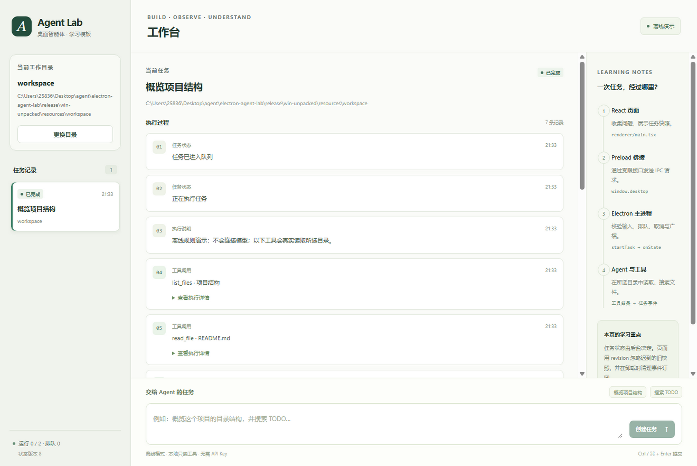

# 验证报告

验证日期：2026-09-10。以下记录只描述实际执行过的检查，不把教学模板等同于完整生产产品。

## 1. 环境

| 项目 | 实际版本或环境 |
|---|---|
| 操作系统 | Windows x64，10.0.26200 |
| Node.js | 24.19.0 |
| pnpm | 11.19.0 |
| Electron | 44.3.0 |
| TypeScript | 7.0.2 |
| React / React DOM | 19.2.8 |
| Vite | 8.2.2 |
| esbuild | 0.28.2 |
| electron-builder | 26.15.3 |
| Playwright | 1.63.0 |

依赖在 package.json 中使用精确版本，并附 pnpm-lock.yaml。首次安装需要网络；安装完成后的 demo 任务不访问模型服务。

## 2. 已执行的检查

| 检查 | 结果 |
|---|---|
| TypeScript 全项目类型检查 | 通过 |
| 核心与任务管理行为测试 | 19 项：18 通过，1 跳过，0 失败 |
| 手写源码逐行中文注释检查 | 21 个文件、1586 个非空行全部通过 |
| 主进程、preload、CLI 构建 | 通过 |
| Vite 生产页面构建 | 通过 |
| 构建后 CLI 搜索 TODO | 通过，命中样例真实路径和行号 |
| 使用 lab 协议的生产桌面验证 | 通过 |
| 使用 Vite 的开发桌面验证 | 通过 |
| Windows 分发目录中的应用验证 | 通过 |
| Windows x64 ZIP 分发构建 | 通过，产物见 release/Electron-Agent-Lab-0.1.0-x64.zip |
| 空状态与任务状态截图检查 | 通过，未发现重叠、横向溢出或操作区遮挡 |

注释检查覆盖 apps、packages、scripts、tests、examples 中手写的 TS、TSX、MJS、CSS 和 HTML。空行不需要注释；第三方依赖和编译产物不在范围内。标准 JSON 的每行说明另见 [CONFIG_EXPLAINED.md](CONFIG_EXPLAINED.md)，YAML 与忽略配置在原文件中使用中文注释。

注释审计检查的是每行存在中文说明，不能替代代码审查。行为正确性由相应测试与实际运行验证支持。

## 3. 行为测试覆盖

- 文件列表、UTF-8 文本读取、搜索结果路径和行号。
- 目录穿越、绝对路径、敏感路径、未知工具和额外参数拒绝。
- 通过 Windows 目录链接访问授权范围之外目录时拒绝。
- 文件字节数、文本字符数、扫描结果数量与搜索结果数量限制。
- 二进制文件拒绝、预取消与执行中取消。
- 离线概览、TODO 搜索真实执行文件工具。
- OpenAI Responses 模拟响应的完整 output 续接和 call_id 对应关系。
- 模型服务错误不直接暴露 API Key 或原始错误响应体。
- 请求取消传递至 fetch，以及工具循环达到上限后的失败状态。
- 两个并发槽、第三任务排队、取消排队任务不执行。
- 运行取消后忽略迟到事件和答案，执行器退出前不提前释放槽位。
- 实际保存后恢复任务；中断的 running/queued 任务恢复为 cancelled。
- 更换默认目录不会修改已创建任务的目录。
- 输入与八个活跃任务上限、快照深拷贝、关闭后拒绝新任务。

跳过项为“文件符号链接指向外部文件”的测试：当前 Windows 账号没有创建该类链接的权限。另一项目录 junction 越界测试实际执行并通过，因此真实路径边界不是完全未经测试。

## 4. 真实桌面验证覆盖

脚本 scripts/smoke-desktop.mjs 使用 Playwright 启动真实 Electron，调用真实 preload 和 IPC，没有在网页中伪造 window.desktop。

验证了以下流程：首次打开 → 输入并提交概览任务 → 读取样例文件 → 展示工具日志与回答 → 搜索 TODO → 并发与排队 → 取消 → 非法输入拒绝 → 退出 → 重启读取历史。

同时读取真实 BrowserWindow 配置，确认 contextIsolation=true、sandbox=true、nodeIntegration=false。

截图采用软件离屏绘制，窗口保持隐藏；测试历史保存在项目 .local-data 中的独立目录。该方法验证页面渲染与通信行为，不代表已经对正常 GPU 模式进行性能测量。




## 5. 分发与复现

源码压缩包用于学习和修改，不附第三方 node_modules。安装依赖后从 README 的命令开始。

Windows ZIP 是完整分发包，不需要另装 Node.js 或 pnpm。请解压整个 ZIP，再运行 Electron Agent Lab.exe；不要只复制一个 exe 而丢弃 resources、locales 或 DLL 文件。

打包时曾遇到单文件 portable 目标的 NSIS 辅助下载中断，最终交付改为 ZIP 目标；package:win 命令和配置已经同步。ZIP 构建已成功。该包没有配置商业发布签名、自动更新服务或品牌图标。

```powershell
# 先安装精确锁定的开发依赖。
pnpm install
# 执行静态检查、行为测试与逐行注释检查。
pnpm check
# 生成桌面和 CLI 的构建结果。
pnpm build
# 验证本地生产资源加载和桌面操作。
pnpm test:desktop
# 可选验证真实 Vite 开发页面。
pnpm test:desktop --dev
# 在 Windows 上重新生成分发包。
pnpm package:win
```

## 6. 未验证或尚未实现的范围

- 未使用用户的真实 API Key 请求外部模型；真实适配器目前通过模拟响应测试。
- 未验证 macOS、Linux 和 ARM64 分发。
- 未测量真实用户负载、长时间运行、GPU 模式、冷启动或内存基线，不能给出生产性能承诺。
- 尚未实现 SSE 逐字流式回答、自动上下文压缩、自动重试、写文件、终端执行、MCP、多智能体和自动更新。
- 目录检查与只读工具不是操作系统级对抗沙箱，普通文件内也可能含有文件名规则无法识别的秘密。
- 历史使用受限数量的本地 JSON，而非数据库；没有加密、数据库事务和多实例写入协调。

以上扩展方向在 [架构分析](ARCHITECTURE.md) 与 [学习路线](LEARNING_GUIDE.md) 中安排为后续练习。
